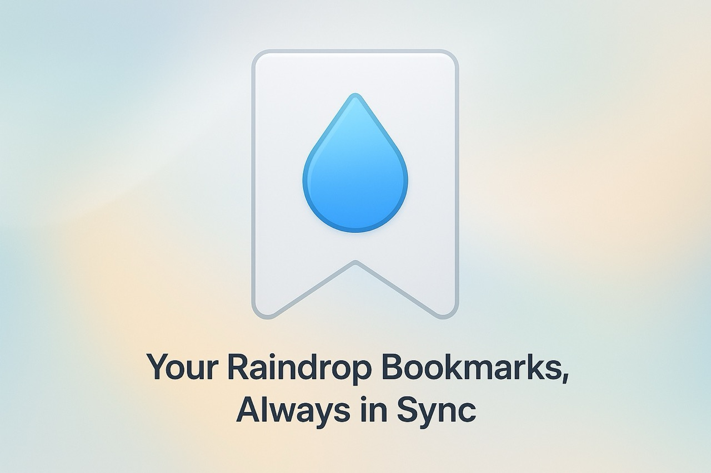

# 💦 Raindrop Sync

A Chrome extension that **automatically exports your [Raindrop.io](https://raindrop.io/) bookmarks daily and syncs them to your browser bookmarks**—no manual export required.

## 🚀 Features

- ⏰ **Automatic Daily Export**
- 🔄 **Seamless Browser Sync**
- 🔒 **Local, Secure Data Handling**

## ⚙️ How It Works

1. **Install** the extension.
2. **Get a Raindrop.io API token:**

   - Visit [Raindrop.io Integrations](https://app.raindrop.io/settings/integrations)
   - Create a **new integration**
   - Copy the **test token**

3. **Enter the token** in the extension options page.
4. Your Raindrop bookmarks will **sync with your Chrome bookmarks daily** (or manually on demand).
