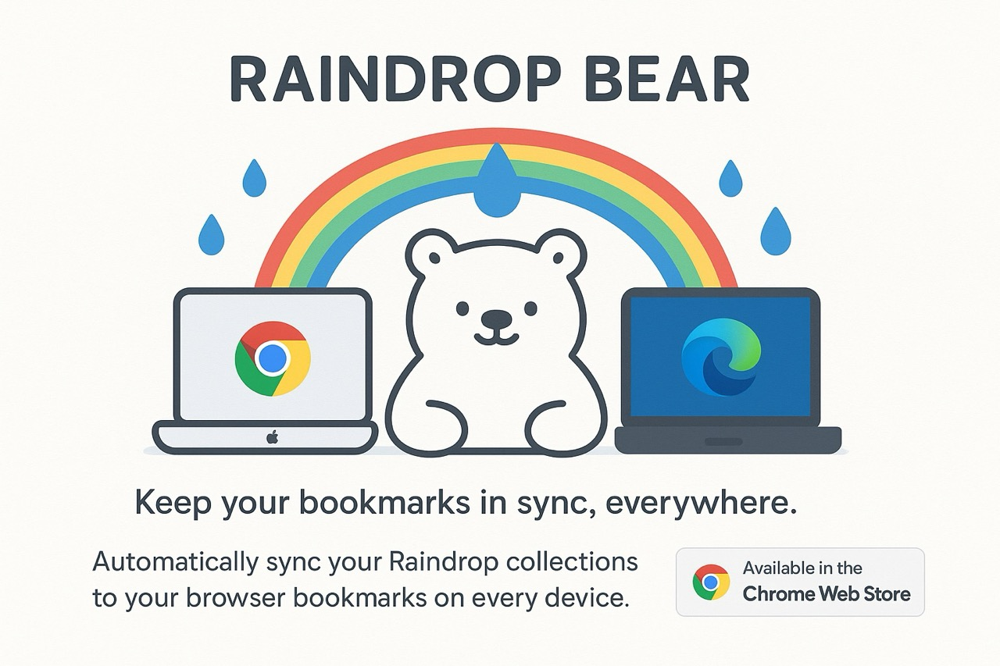

# 🐻‍❄️💧 Raindrop Bear

**Let your bookmarks hibernate safely!**

---

## 🐻 What is Raindrop Bear?

**Raindrop Bear** is your friendly browser extension that automatically syncs your [Raindrop.io](https://raindrop.io/) bookmarks to your browser. No more lost links, no more messy folders—just a happy bear helping you keep your digital forest neat and tidy!

---

## 🌳 Features

- 💦 **Automatic Sync:** Raindrop Bear collects your Raindrop.io bookmarks every day—so you can nap, snack, or forage for berries while your links stay organized.
- 🐾 **One-Click Save:** Click the bear! Instantly save the current tab to Raindrop and your browser bookmarks. Rawr!
- 🐟 **Real-time Status:** Raindrop Bear gives you friendly feedback when syncing—no angry grizzlies here.
- 🛡️ **Background Magic:** Syncing happens quietly in the woods (background), so you never lose your spot.
- 📂 **Tidy Folders:** Everything is stored in a neat “RaindropSync” folder—no more bookmark chaos!

---

## 🍯 Quick Start

1. **Install** Raindrop Bear from the [Chrome Web Store](https://chromewebstore.google.com/detail/raindrop-sync/gkcgbmlbjcdmnifhcmfgkafekaohjcof?authuser=0&hl=en).
2. **Get your Raindrop.io API Token** from [here](https://app.raindrop.io/settings/integrations).
3. **Open the extension options** (right-click the bear 🐻‍❄️, choose “Options”).
4. **Paste your API token** and hit Save. Test the connection—if the bear smiles, you’re good!
5. That’s it! Enjoy sweet, organized bookmarks with zero effort.

---

## 🧸 Why use Raindrop Bear?

- Bears are great at remembering where they hide things (ask any squirrel).
- No more manual exports—just automatic, daily bookmark naps.
- The bear icon makes you smile every time you click it. Science probably agrees.

---

## 🚨 Permissions

- **Browser bookmarks**: To tidy up your links.
- **Raindrop.io API access**: To fetch and save your precious berries—uh, bookmarks.

---

## 🦦 FAQ

**Q: Will Raindrop Bear eat my bookmarks?**
A: Nope! Only honey and salmon.

**Q: I have too many bookmarks!**
A: That’s ok. Bears love a challenge. Raindrop Bear will keep syncing and sorting, no matter how big your stash.

**Q: Can I manually sync?**
A: Yes! Click the bear icon for instant action. Roar of approval optional.

---

## 💌 Feedback

If you spot a bug, have a feature idea, or just want to share bear memes, open an issue. The bear will read every message (slowly, with big paws).

---

## 📜 License

MIT — because even bears believe in sharing.

---

_May your bookmarks stay cozy and your links never wander off. Happy browsing!_
